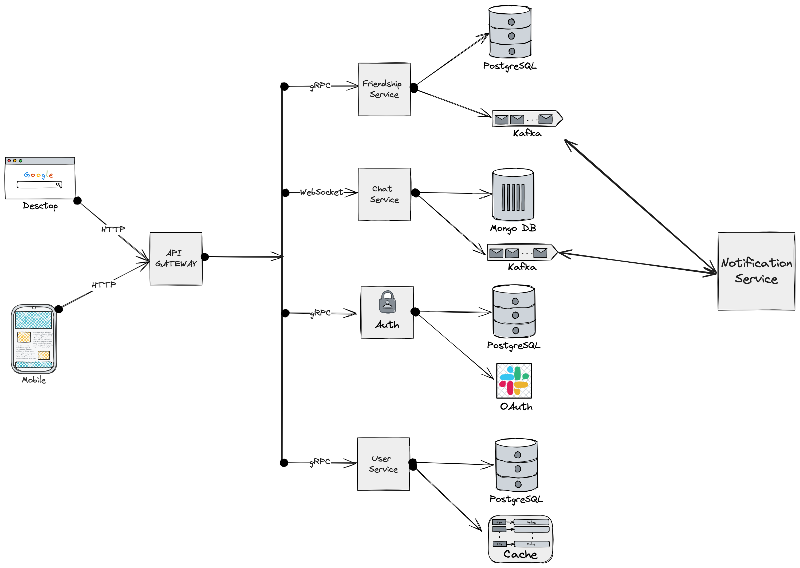

# Домашнее задание 1

Требуется спроектировать приложение мессенджер

## Архитектура

### Auth Service

**Функции:** Регистрация пользователя, вход/авторизация, управление сессиями, OAuth

**API:** 
- `POST /register` - регистрация пользователя
- `POST /login` - вход пользователя
- `POST /oauth` - OAuth аутентификация
- `POST /logout` - выход пользователя

**PostgreSQL:**
- Поддержка транзакций
- Надежность и безопасность
- Open Source
- Сложные запросы
- Соответствие ACID

**Redis:**
- Низкое время задержки при чтении и записи
- Подходит для кеширования

### User Service

**Функции:** Управление профилем пользователя, поиск пользователей

**API:** 
- `GET /user/{username}` - получить информацию о пользователе
- `PUT /user/{username}` - обновить профиль пользователя

**PostgreSQL:**
- Поддержка транзакций
- Надежность и безопасность
- Open Source
- Сложные запросы
- Соответствие ACID

### Friendship Service

**Функции:** Управление подписками пользователей друг на друга

**Взаимодействие:** User Service

**API:** 
- `POST /friends/request` - отправить запрос на дружбу
- `POST /friends/accept` - принять запрос на дружбу
- `POST /friends/reject` - отклонить запрос на дружбу
- `DELETE /friends/remove` - удалить из друзей
- `GET /friends/{userId}` - получить список друзей

**PostgreSQL:**
- Поддержка транзакций
- Надежность и безопасность
- Open Source
- Сложные запросы
- Соответствие ACID

### Chat Service

**Функции:** Обмен сообщениями между пользователями

**Взаимодействие:** Notification Service

**API:** 
- `WS /chat` - устанавливает WebSocket соединение для отправки и получения сообщений
- `GET /chat/{conversationId}` - получить историю сообщений из чата (HTTP запрос)

**MongoDB:**
- Сообщения могут иметь различную структуру (текст, изображения, файлы и т.д.). MongoDB предоставляет гибкую модель данных, которая хорошо подходит для таких сценариев
- MongoDB легко масштабируется горизонтально, что важно при высоких нагрузках в чате
- В чате важно быстрое хранение и извлечение сообщений. MongoDB обеспечивает высокую производительность этих операций
- Сообщения удобно хранить в виде документов JSON, что упрощает работу с данными

### Notification Service

**Функции:** Отправка уведомлений

**Взаимодействие:** Chat Service, Friendship Service

**Kafka:**
- Простая: только записывает и отдает
- Пропускная способность: обрабатывает миллионы запросов в секунду
- Позволяет перечитывать сообщения
- Позволяет читать сообщения пачками

